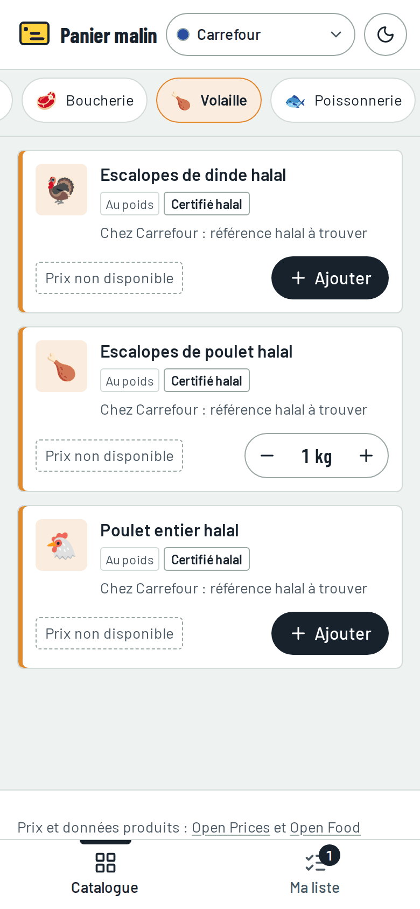
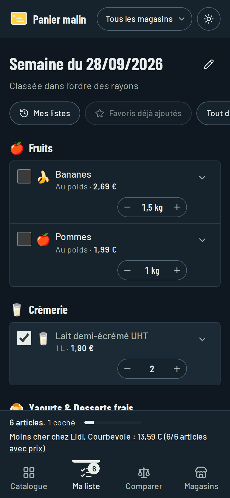
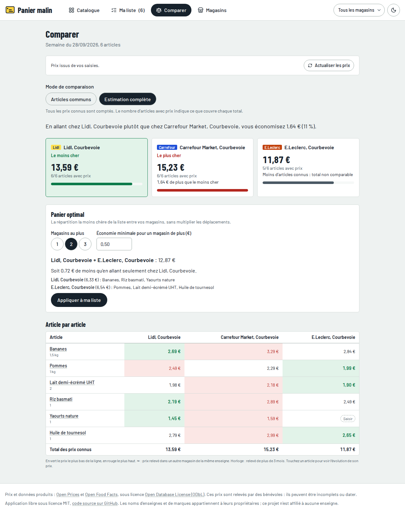
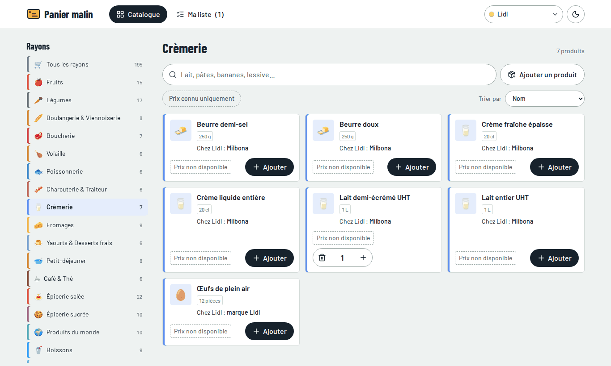

# Panier malin

Liste de courses de la semaine et comparateur de prix entre magasins, alimenté par les relevés collaboratifs d'[Open Prices](https://prices.openfoodfacts.org), le projet de prix d'Open Food Facts.

Application web libre, sans compte ni serveur : tout reste dans votre navigateur.

> **État du projet : V1 complète (étapes 1 à 6) et application installable.** La richesse des prix dépend des relevés Open Prices et des codes-barres du catalogue : voir les [limites connues](#limites-connues).

<p>
  
  
</p>



## Ce que fait l'application

- **Catalogue halal de 195 produits courants**, rangés dans 22 rayons présentés dans l'ordre de passage en magasin. Ni porc, ni alcool, ni gélatine de porc ; la viande et la volaille sont certifiées halal.
- **Une fiche par produit** : vous ajoutez « Bananes » ou « Lait demi-écrémé UHT, 1 L », sans choisir de marque. Derrière chaque fiche, l'application connaît la gamme la moins chère de chaque enseigne (premier prix ou marque de l'enseigne), et le comparateur s'en sert.
- **Recherche instantanée**, insensible aux accents et aux majuscules, filtres « Mes favoris » et « Prix connu uniquement », tri par prix.
- **« Mon magasin »**, en haut de l'écran : chaque fiche indique quoi prendre en rayon dans cette enseigne (« Chez Lidl : Milbona ») et son prix dans vos magasins.
- **Produits personnalisés** : pour un produit précis, saisissez son code-barres ; l'application récupère le nom, la marque, la photo et le format sur Open Food Facts.
- **Liste de la semaine** : nom modifiable, quantités à la pièce ou au poids, notes, cases à cocher en magasin, classement par rayon ou par magasin, historique des semaines, reprise de la liste précédente, ajout des favoris en un geste, et un bandeau avec le total estimé.
- **Mes magasins** : jusqu'à 10 magasins précis, trouvés sur Open Prices par ville, par nom ou autour de vous, ou ajoutés à la main ; un magasin principal.
- **Des prix sourcés** : relevés Open Prices et vos propres saisies. Chaque prix indique son magasin, sa date et sa source ; un relevé de plus de trois mois est signalé ; sans relevé, « Prix non disponible » et un bouton pour saisir le vôtre, puis le partager sur Open Prices.
- **Comparateur** : total par magasin en cartes et en barres, économie en euros et en pourcentage, couverture, deux modes (articles communs ou estimation complète), tableau article par magasin en vert et rouge, historique des prix en courbes.
- **Panier optimal** : la répartition la moins chère entre 1 à 3 magasins, avec une économie minimale par magasin supplémentaire, applicable à la liste en un geste.
- **Export PDF** : une liste A4 en noir et blanc par magasin, avec cases à cocher, et le tableau comparatif en paysage ; impression directe de la liste.
- **Application installable** sur téléphone et ordinateur, utilisable hors connexion avec les derniers prix chargés ; sauvegarde et restauration de vos données dans un fichier.
- Mode sombre, affichage adapté au téléphone, navigation complète au clavier et au lecteur d'écran.

## Feuille de route

| Étape | Contenu                                                                                                               | État     |
| ----- | --------------------------------------------------------------------------------------------------------------------- | -------- |
| 1     | Catalogue, recherche, filtres, produits personnalisés                                                                 | Terminée |
| 2     | Liste complète : nom modifiable, notes, cases à cocher, historique des semaines, reprise, favoris, bandeau du total   | Terminée |
| 3     | Magasins et prix : Open Prices groupé, cache de 24 h, saisie manuelle, magasins proches, propositions de codes-barres | Terminée |
| 4     | Comparateur : total par magasin, économies, couverture, tableau produit par magasin, historique des prix              | Terminée |
| 5     | Panier optimal réparti sur 1 à 3 magasins                                                                             | Terminée |
| 6     | Export PDF par magasin et tableau comparatif, impression                                                              | Terminée |
| Bonus | Application installable et utilisable hors connexion (PWA)                                                            | Terminée |

Ensuite :

- **Synchronisation entre appareils avec Supabase.** L'interface est prête (`src/services/sync.ts`) : un adaptateur distant n'aura qu'à envoyer et recevoir un instantané des données. En attendant, « Magasins > Vos données » exporte et importe une sauvegarde.
- **Compléter les codes-barres des références** avec le [script de propositions](#compléter-les-codes-barres), pour que les produits emballés aient leurs prix Open Prices.

## Démarrer en local

Prérequis : Node.js 22 (20.19 au minimum) et npm.

```bash
git clone https://github.com/VOTRE-COMPTE/panier-malin.git
cd panier-malin
npm ci
npm run dev
```

L'application s'ouvre sur http://localhost:5173.

| Commande                                | Rôle                                                                           |
| --------------------------------------- | ------------------------------------------------------------------------------ |
| `npm run dev`                           | Serveur de développement avec rechargement à chaud                             |
| `npm run build`                         | Vérification des types puis build de production dans `dist/`                   |
| `npm run preview`                       | Sert le build de production en local                                           |
| `npm test`                              | Tests unitaires et d'interface (Vitest, Testing Library, MSW)                  |
| `npm run lint`                          | ESLint                                                                         |
| `npm run format`                        | Formate le code avec Prettier                                                  |
| `npm run typecheck`                     | Vérification TypeScript seule                                                  |
| `npm run format:check`                  | Vérifie le formatage, comme l'intégration continue                             |
| `npm run eans:proposer`                 | Propose des codes-barres pour les références, à relire (accès Internet requis) |
| `npm run eans:appliquer -- fichier.csv` | Ajoute au catalogue les codes-barres validés                                   |

## Organisation du code

```
src/
├── components/     interface : catalog, compare, layout, list, pdf, prices, providers, ui
├── data/           catalogue (products.json), rayons, enseignes
├── hooks/          contextes React, état persistant, offres et comparaison
├── pages/          écrans : catalogue, liste, comparer, magasins
├── services/       logique métier pure et accès aux API, chacun avec ses tests
├── test/           configuration des tests et réponses simulées des API
├── types/          modèle de données TypeScript
└── utils/          texte, prix en centimes, codes-barres, unités, dates
scripts/            propositions et application des codes-barres du catalogue
```

La logique métier (filtres, liste, calculs de prix, comparaison, panier optimal, contenu des PDF) vit dans `src/services/` sous forme de fonctions pures, sans React, testées indépendamment de l'interface. Les prix passent par l'interface `PriceProvider` (`src/services/priceProviders.ts`) : Open Prices et vos saisies en sont deux implémentations, et le comparateur ne dépend que d'elle.

## Le catalogue

Le catalogue est un simple fichier, [`src/data/products.json`](src/data/products.json), modifiable par tous. Chaque ligne est une fiche produit :

```json
{
  "id": "lait-demi-ecreme-uht",
  "name": "Lait demi-écrémé UHT",
  "categoryId": "cremerie",
  "icon": "🥛",
  "pack": { "count": 1, "size": 1000, "unit": "ml" },
  "soldByWeight": false,
  "halal": false,
  "references": [
    { "enseigne": "carrefour", "brand": "Simpl", "ean": "" },
    { "enseigne": "lidl", "brand": "Milbona", "ean": "" },
    { "enseigne": "leclerc", "brand": "Eco+", "ean": "" }
  ]
}
```

| Champ               | Signification                                                                        |
| ------------------- | ------------------------------------------------------------------------------------ |
| `id`                | Identifiant stable et lisible, tiré du nom                                           |
| `pack`              | Format courant : `count` × `size` `unit` (`g`, `ml` ou `piece`) ; 1 kg pour le vrac  |
| `soldByWeight`      | Vendu au poids : la quantité de la liste est exprimée en kg                          |
| `halal`             | Viande, volaille ou charcuterie certifiée halal                                      |
| `references`        | Pour chaque enseigne, au plus une référence : sa gamme la moins chère connue         |
| `references[].ean`  | Code-barres EAN-8 ou EAN-13 ; chaîne vide tant qu'il n'a pas été vérifié             |
| `references[].pack` | Format de la référence, s'il diffère de celui de la fiche (couches par 44 ou par 48) |
| `offCategoryTag`    | Pour le vrac : catégorie Open Food Facts utilisée par les prix au kilo d'Open Prices |

Une fiche sans référence est normale pour le vrac (fruits, légumes, pain) et pour la viande halal, dont les références restent à trouver : son prix viendra des relevés au kilo d'Open Prices ou de vos propres saisies.

### Un catalogue halal

Le catalogue partagé ne contient ni porc ni dérivés, aucune boisson alcoolisée, aucun produit à base de gélatine, et uniquement de la viande, de la volaille et de la charcuterie certifiées halal. Poissons, fruits de mer et fromages sont conservés. Ces règles sont vérifiées automatiquement par les tests à chaque modification du catalogue ; elles ne s'appliquent pas aux produits personnalisés, qui restent sur votre appareil.

Les cas limites (arômes, additifs d'origine animale, alcool utilisé en cuisine) ne peuvent pas être détectés à partir du seul nom d'un produit : ils seront contrôlés avec les ingrédients et les labels d'Open Food Facts quand les codes-barres seront renseignés. La sauce soja, qui contient souvent de l'alcool de fermentation, a été écartée par prudence.

### La référence la moins chère de chaque enseigne

Tant que les prix réels ne sont pas chargés, « la moins chère » repose sur les gammes des enseignes : Simpl quand le produit existe dans cette gamme, sinon Carrefour Classic' chez Carrefour ; les marques propres de Lidl ; Eco+ quand le produit existe dans cette gamme, sinon Marque Repère chez E.Leclerc. Les marques nationales et le bio ne sont pas retenus. Ces choix seront vérifiés avec les prix d'Open Prices et corrigés au besoin.

H Market et Marka Market sont gérées sans référence : je ne connais pas leurs marques propres. Leurs prix viendront de vos saisies, ou de contributeurs qui connaissent ces magasins.

Autres règles vérifiées par les tests : **un code-barres n'est jamais inventé** (tous sont vides dans le catalogue initial, et la clé de contrôle de chaque code saisi est vérifiée), une seule référence par enseigne et par fiche, et des formats comparables entre une fiche et ses références. Les formats du catalogue initial sont des formats courants, pas des relevés : ils peuvent différer légèrement du produit en rayon.

Pour ajouter une fiche ou corriger une référence, suivez le [guide de contribution](CONTRIBUTING.md) ou ouvrez un ticket avec le modèle correspondant.

## Données Open Prices et Open Food Facts

L'application interroge directement, depuis votre navigateur :

- **Open Food Facts** pour retrouver un produit à partir de son code-barres (nom, marque, photo, format) ;
- **Open Prices** pour les magasins, les prix relevés et l'historique des prix.

Ces données sont collaboratives : des bénévoles photographient des tickets et des étiquettes. Elles sont donc **incomplètes et parfois anciennes**. L'application le montre toujours : chaque prix indique sa source, sa date et son magasin, un prix de plus de trois mois est signalé, et un produit sans relevé affiche « Prix non disponible » avec la possibilité de saisir son propre prix.

Pour respecter ces services gratuits, l'application :

- espace ses appels à Open Food Facts de 4 secondes, dans la limite de 15 lectures de produit par minute indiquée par leur documentation ;
- garde en cache les fiches produits 30 jours (1 jour pour un produit introuvable) ;
- regroupe ses demandes de prix (codes-barres par lots de 40, vrac de vos magasins en une seule requête, 5 pages au plus par requête, 300 ms entre deux appels) et les garde en cache 24 heures, même après fermeture de la page ; le bouton « Actualiser les prix » les recharge.

Vous pouvez enrichir ces bases vous-même sur [Open Prices](https://prices.openfoodfacts.org) et [Open Food Facts](https://world.openfoodfacts.org) : chaque relevé ajouté profite à tous.

**Licence des données.** Open Prices et Open Food Facts sont publiés sous [Open Database License (ODbL)](https://opendatacommons.org/licenses/odbl/1-0/). L'application les cite dans son pied de page. Toute base de données dérivée et rendue publique devrait elle aussi être publiée sous ODbL.

## Compléter les codes-barres

Les références des enseignes (Milbona chez Lidl, Simpl chez Carrefour…) sont livrées **sans code-barres** : un code inventé donnerait de faux prix. Tant qu'une référence n'a pas de code, ses prix viennent de vos saisies ; le vrac (fruits, légumes) a déjà ses prix au kilo ou à la pièce par catégorie.

Deux scripts aident à combler ce manque, avec une relecture humaine obligatoire :

1. `npm run eans:proposer` interroge Open Prices (une requête par seconde) et écrit `scripts/out/propositions-eans.csv` : pour chaque référence, jusqu'à trois produits candidats, avec nom, marque, format, nombre de prix relevés et lien vers la fiche Open Food Facts. Options : `npm run eans:proposer -- --rayon cremerie --limite 20`.
2. Ouvrez le fichier dans un tableur, vérifiez la photo et le format de chaque candidat, et écrivez « oui » dans la colonne `valider` des bons.
3. `npm run eans:appliquer -- scripts/out/propositions-eans.csv` ajoute les codes validés, vérifie le catalogue (code valide, pas de doublon) et n'écrit rien en cas d'erreur.

Ces scripts demandent un accès à Internet ; un assistant de code comme Claude Code peut aussi les lancer.

## Méthode de comparaison

Les règles sont codées dans `src/services/pricing.ts` et `src/services/comparator.ts`, sous forme de fonctions pures testées.

- **Calculs en centimes entiers**, jamais en nombres à virgule, pour que les totaux tombent juste.
- **Un prix par fiche et par magasin** : celui de la référence de l'enseigne, ou le prix au kilo ou à la pièce du vrac. Quand le format de la référence diffère de celui de la fiche (couches par 44 ou par 48), le coût compte les paquets entiers à acheter ; au poids, il est proportionnel. Le prix au kilo, au litre ou à la pièce est affiché pour comparer.
- **Choix du prix** : votre saisie manuelle passe d'abord ; puis le relevé le plus récent du magasin ; à défaut, un relevé d'un autre magasin de la même enseigne, signalé comme tel (option désactivable). Les prix promotionnels sont écartés, sauf si le prix hors promotion est connu. Un relevé de plus de trois mois reste utilisé, mais signalé.
- **Deux modes de total** : « Articles communs » compare les magasins sur les seuls articles dont le prix est connu partout ; « Estimation complète » inclut tout ce qui est connu et indique, pour chaque magasin, combien d'articles le total couvre ; seul un magasin qui couvre autant d'articles que les autres peut être désigné moins cher.
- **Panier optimal** : toutes les combinaisons de 1 à 3 magasins sont évaluées (175 combinaisons pour 10 magasins). La combinaison retenue couvre le plus d'articles, puis coûte le moins cher, chaque magasin supplémentaire devant faire économiser au moins le seuil choisi (par exemple 3 €). Les articles sans prix sont signalés « à vérifier » et placés chez votre magasin principal. L'économie affichée est calculée par rapport au meilleur magasin unique, sur les articles qu'il connaît aussi.

## Limites connues

- **Peu de prix au départ** : sans codes-barres dans le catalogue (voir plus haut), seuls le vrac et vos saisies alimentent le comparateur. Plus les références sont complétées, plus la comparaison est riche.
- **Données collaboratives** : selon les villes et les magasins, Open Prices peut compter peu de relevés, ou des relevés anciens ; c'est toujours signalé.
- **Vérification en conditions réelles** : pendant le développement, l'accès à Open Prices et à Open Food Facts était bloqué. Les appels ont été écrits d'après le code source de ces services (paramètres, pagination, format des réponses) et testés sur des réponses simulées fidèles ; un premier essai réel reste à faire après la mise en ligne.
- **H Market et Marka Market** n'ont pas de références dans le catalogue : leurs prix viennent de vos saisies.
- **Pas encore de synchronisation automatique** entre appareils : utilisez l'export et l'import de sauvegarde.

## Déployer sur GitHub Pages

1. Créez un dépôt sur GitHub et poussez-y le code.
2. Dans le dépôt : **Settings > Pages > Build and deployment > Source : GitHub Actions**.
3. Chaque mise à jour de la branche `main` lance le workflow [`.github/workflows/deploy.yml`](.github/workflows/deploy.yml) : lint, formatage, types, tests, build, puis publication sur `https://VOTRE-COMPTE.github.io/NOM-DU-DEPOT/`. Les propositions de modification (pull requests) sont vérifiées sans être publiées.
4. Remplacez l'adresse du dépôt dans [`src/config.ts`](src/config.ts) : elle est affichée dans le pied de page.

Le chemin du site suit automatiquement le nom du dépôt (variable `BASE_PATH`). Les adresses internes utilisent une ancre (`…/#/liste`), car GitHub Pages ne sait pas servir une application à pages multiples : un rafraîchissement sur `/liste` renverrait sinon une erreur 404.

## Données personnelles

- Pas de compte, pas de serveur, pas de mesure d'audience.
- Listes, magasins, prix saisis, préférences et produits personnalisés sont enregistrés dans le stockage local du navigateur. Vider les données du site les efface ; exportez-les d'abord si besoin (« Magasins > Vos données »).
- Les recherches par code-barres et les demandes de prix partent de votre navigateur vers Open Food Facts et Open Prices, qui voient donc votre adresse IP, comme pour toute visite de leur site.
- « Autour de moi » n'utilise votre position qu'à votre demande, pour chercher les magasins proches sur Open Prices ; elle n'est pas enregistrée.

## Choix techniques

- React 18, Vite 7, TypeScript strict, Tailwind CSS 4, React Router 7, icônes Lucide.
- TanStack Query 5 pour les appels Open Prices et leur cache de 24 h conservé dans le navigateur ; Recharts 2 pour les courbes ; @react-pdf/renderer 4 pour les PDF ; vite-plugin-pwa 1 (Workbox 7) pour l'installation et le hors-connexion.
- Les modules lourds (PDF, graphiques) ne sont chargés qu'au moment de s'en servir.
- Tests : Vitest 3, Testing Library, MSW 2 pour simuler les API sans réseau.
- Les versions majeures sont épinglées sur des versions dont l'API a été vérifiée pendant le développement ; des versions plus récentes existent (Vite 8, Vitest 5, ESLint 10, MSW 3) et pourront être adoptées après vérification.
- Les données locales sont enregistrées avec un numéro de schéma, pour pouvoir migrer les listes des utilisateurs quand le modèle évolue.

## Contribuer

Les contributions sont bienvenues, en particulier pour compléter le catalogue et vérifier les codes-barres. Consultez le [guide de contribution](CONTRIBUTING.md).

## Licence et marques

Le code est publié sous [licence MIT](LICENSE). Les données de prix et de produits appartiennent à leurs projets respectifs et sont publiées sous ODbL.

Les noms d'enseignes et de marques cités appartiennent à leurs propriétaires. Ce projet n'est affilié à aucune enseigne et n'utilise aucun logo officiel : chaque enseigne est représentée par un badge coloré portant son nom.
